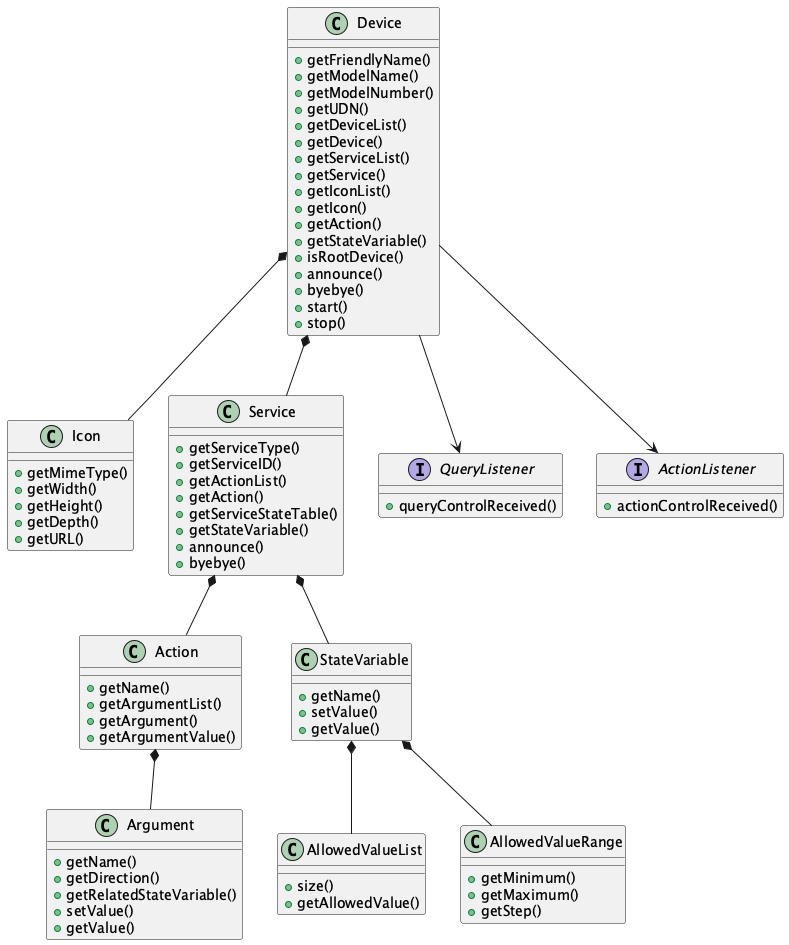
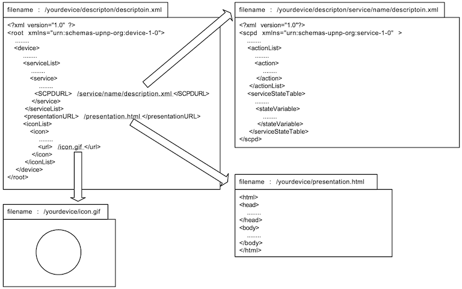

# Programming Guide

## Introduction

The UPnP™ architecture is based on open networking to enable the discovery and control of networked devices and services, such as media servers and players at home.

The UPnP™ architecture relies on many standard protocols, such as GENA, SSDP, SOAP, HTTPU, and HTTP. Therefore, you need to understand and implement these protocols to create your UPnP™ devices.

cybergarage-upnp is a development package for UPnP™ developers. It automatically handles these protocols and supports the quick creation of your devices and control points. Please visit the official [UPnP™ Forum](http://www.upnp.org/) site for more detailed information about UPnP™.

## Device

The following static structure diagram shows the related classes of cybergarage-upnp used to create your UPnP™ device. The device can have some embedded devices and services, and the services can have some actions and state variables.



The above static structure diagram is simplified to explain the concept.

### Description

First, you need to create some description files for your devices and services when you want to create your UPnP™ device.



The description of the root device should not include the URLBase element because it is added automatically when the device is created using the description.

The service descriptions are required to create a device, but the presentationURL and the iconList are recommended options. Please refer to the UPnP™ specifications for more detailed information about the description format.

### Initiating

To create a UPnP™ device, create an instance of the Device class with the root description file. The created device is a root device, and only the root device can be activated using Device::start(). The device is announced to the UPnP™ network when it is started. The following example shows how to initiate a device.

```java
import org.cybergarage.upnp.*;
import org.cybergarage.upnp.device.*;

String descriptionFileName = "description/description.xml";

try {
  Device upnpDev = new Device(descriptionFileName);
  // ...existing code...
  upnpDev.start();
} catch (InvalidDescriptionException e) {
  System.out.println("InvalidDescriptionException = " + e.getMessage());
}
```

The InvalidDescriptionException occurs when the description is invalid. Use the getMessage() method to know the reason for the exception in more detail.

Alternatively, you can load the descriptions using Device::loadDescription() and Service::loadSCPD() instead of using description files, as shown below. The loading methods throw an exception when the loading fails.

```java
String DEVICE_DESCRIPTION =
  "<?xml version=\"1.0\" ?>\n" +
  "<root xmlns=\"urn:schemas-upnp-org:device-1-0\">\n" +
  // ...existing code...
  "</root>";

String SERVICE_DESCRIPTION =
  "<?xml version=\"1.0\"?>\n" +
  "<scpd xmlns=\"urn:schemas-upnp-org:service-1-0\">\n" +
  // ...existing code...
  "</scpd>";

try {
  Device upnpDev = new Device();
  boolean descSuccess = upnpDev.loadDescription(DEVICE_DESCRIPTION);
  Service upnpService = upnpDev.getService("urn:schemas-upnp-org:service:****:1");
  boolean scpdSuccess = upnpService.loadSCPD(SERVICE_DESCRIPTION); 
} catch (InvalidDescriptionException e) {
  System.out.println("InvalidDescriptionException = " + e.getMessage());
}
```

The active root device has some server processes and automatically returns responses when a control point sends a request to the device. For example, the device has an HTTP server to return the description files when a control point requests them. The device searches for an available port for the HTTP server automatically when it is started.


The root device is created with the following default parameters. You can change these parameters using the following methods before starting the root device.

| Parameter       | Default          | Setter Method     |
|-----------------|------------------|---------------------|
| HTTP port       | 4004             | setHTTPPort()       |
| Description URI | /description.xml | setDescriptionURI() |
| Lease time      | 1800             | setLeaseTime()      |

### Notify

Your device is announced to the UPnP™ network using a notify message with ssdp::alive automatically when the device is started using Device::start(). When the device is stopped using Device::stop(), a notify message is posted with ssdp::byebye. You can also announce the notify messages manually using Device::announce() and Device::byebye().


When a control point sends a search request with M-SEARCH to the UPnP™ network, the active device sends the search response to the control point automatically. The device repeats the announcement within the lease time automatically.

### Embedded Devices

Devices may have some embedded devices. Use Device::getDeviceList() to get the list of embedded devices. The following example outputs the friendly names of all embedded devices in the device.

```java
public void printDevice(Device dev) {
  String devName = dev.getFriendlyName();
  System.out.println(devName);
  DeviceList childDevList = dev.getDeviceList();
  int nChildDevs = childDevList.size();
  for (int n = 0; n < nChildDevs; n++) {
    Device childDev = childDevList.getDevice(n);
    printDevice(childDev);
  }
}
// ...existing code...
Device rootDev = ...;
// ...existing code...
DeviceList childDevList = rootDev.getDeviceList();
int nChildDevs = childDevList.size();
for (int n = 0; n < nChildDevs; n++) {
  Device childDev = childDevList.getDevice(n);
  printDevice(childDev);
}
```

You can find an embedded device by the friendly name or UDN using Device::getDevice(). The following example gets an embedded device by the friendly name.

```java
Device homeServerDev = ...;
Device musicDev = homeServerDev.getDevice("music");
```

### Service

Use Device::getServiceList() to access the embedded services of the device. The service may have some actions and state variables. Use Service::getActionList() to get the actions, and use Service::getServiceStateTable() to get the state variables. The following example outputs all actions and state variables in a device.

```java
Device dev = ...;
ServiceList serviceList = dev.getServiceList();
int serviceCnt = serviceList.size();
for (int n = 0; n < serviceCnt; n++) {
  Service service = serviceList.getService(n);
  ActionList actionList = service.getActionList();
  int actionCnt = actionList.size();
  for (int i = 0; i < actionCnt; i++) {
    Action action = actionList.getAction(i);
    System.out.println("action [" + i + "] = " + action.getName()); 
  }
  ServiceStateTable stateTable = service.getServiceStateTable();
  int varCnt = stateTable.size();
  for (int i = 0; i < varCnt; i++) {
    StateVariable stateVar = stateTable.getServiceStateVariable(i);
    System.out.println("stateVar [" + i + "] = " + stateVar.getName());
  }
}
```

You can find a service in the device by the service ID using Device::getService(), and you can find an action or state variable in the service by name too. Use Device::getAction() or Service::getAction() to find the action, and use Device::getStateVariable() or Service::getStateVariable() to find the state variable. The following example gets a service, an action, and a state variable in a device by name.

```java
Device clockDev = ...;
Service timerService = clockDev.getService("timer");
Action getTimeAct = clockDev.getAction("GetTime");
StateVariable timeStat = clockDev.getStateVariable("time");
```

### Control

To receive action control events from control points, the device needs to implement the ActionListener interface. The listener must implement the actionControlReceived() method, which has the action and argument list parameters. The input arguments contain the values passed from the control point. Set the response values in the output arguments and return true when the request is valid. Otherwise, return false when the request is invalid. A UPnPError response is returned to the control point automatically when the returned value is false or the device does not implement the interface. The default UPnPError is INVALID_ACTION, but you can use Action::setStatus() to return other UPnP errors.

To receive query control events from control points, the device needs to implement the QueryListener interface. The listener must implement the queryControlReceived() method, which has the service variable parameter and returns true when the request is valid. Otherwise, return false when the request is invalid. A UPnPError response is returned to the control point automatically when the returned value is false or the device does not implement the interface. The default UPnPError is INVALID_ACTION, but you can use StateVariable::setStatus() to return other UPnP errors. The following sample is a clock device. The device executes two action control requests and a query control request.

```java
public class ClockDevice extends Device implements ActionListener, QueryListener {
  public ClockDevice() {
    super("/clock/www/description.xml");
    Action setTimeAction = getAction("SetTime");
    setTimeAction.setActionListener(this);
    Action getTimeAction = getAction("GetTime");
    getTimeAction.setActionListener(this);
    StateVariable stateVar = getStateVariable("Timer");
    stateVar.setQueryListener(this); 
  }

  public boolean actionControlReceived(Action action) {
    ArgumentList argList = action.getArgumentList();
    String actionName = action.getName();
    if (actionName.equals("SetTime")) {
      Argument inTime = argList.getArgument("time");
      String timeValue = inTime.getValue();
      if (timeValue == null || timeValue.length() <= 0)
        return false;
      // ...existing code...
      Argument outResult = argList.getArgument("result");
      outResult.setValue("TRUE");
      return true;
    } else if (actionName.equals("GetTime")) {
      String currTimeStr = ...;
      Argument currTimeArg = argList.getArgument("currTime");
      currTimeArg.setValue(currTimeStr);
      return true;
    }
    action.setStatus(UPnP.INVALID_ACTION, "...");
    return false;
  }

  public boolean queryControlReceived(StateVariable stateVar) {
    String varName = stateVar.getName();
    if (varName.equals("Time")) {
      String currTimeStr = ...;
      stateVar.setValue(currTimeStr);
      return true;
    }
    stateVar.setStatus(UPnP.INVALID_VAR, "...");
    return false;
  }
}
```

Use Device::setActionListener() or Service::setActionListener() to add a listener to all control actions in a device or a service. Use Device::setQueryListener() or Service::setQueryListener() to add a listener to all query actions in a device or a service. The following sample sets a listener to all actions in a device.

```java
class ClockDevice extends Device implements ActionListener, QueryListener {
  public ClockDevice() {
    super("/clock/www/description.xml");
    setActionListener(this);
    setQueryListener(this);
  }
  
  public boolean actionControlReceived(Action action) {
    // ...existing code...
  }

  public boolean queryControlReceived(StateVariable stateVar) {
    // ...existing code...
  }
}
```

### Event

The control point may subscribe to some events of the device. You do not need to manage the subscription messages from control points because the device manages the subscription messages automatically. For example, the device adds a control point to the subscriber list when the control point sends a subscription message to the device, or the device removes the control point from the subscriber list when the control point sends an unsubscription message.

Use ServiceStateVariable::setValue() when you want to send the state to the subscribers. The event is sent to the subscribers automatically when the state variable is updated using ServiceStateVariable::setValue(). The following example updates a state variable, and the updated state is distributed to the subscribers automatically.

```java
Device clockDevice = ...;
StateVariable timeVar = clockDevice.getStateVariable("Time");
String timeStr = ...;
timeVar.setValue(timeStr);
```

## Control Point

### Class Overview

The following static structure diagram shows the related classes of cybergarage-upnp used to create your UPnP™ control point. The control point can have some root devices in the UPnP™ network.


### Initiating

To create a UPnP™ control point, create an instance of the ControlPoint class. Use ControlPoint::start() to activate the control point. The control point multicasts a discovery message searching for all devices to the UPnP™ network automatically when it is activated.

```java
import org.cybergarage.upnp.*;
import org.cybergarage.upnp.device.*;
// ...existing code...
ControlPoint ctrlPoint = new ControlPoint();
// ...existing code...
ctrlPoint.start();
```

The active control point has some server processes and automatically returns responses when other UPnP™ devices send messages to it. For example, the control point has an SSDP server to get M-SEARCH responses, and it searches for an available port for the SSDP server automatically when it is started. The control point is created with the following default parameters.

| Parameter        | Default   | Setter Method    |
|------------------|-----------|------------------|
| HTTP port        | 39500     | setHTTPPort()    |
| SSDP port        | 39400     | setSSDPPort()    |
| Subscription URI | /eventSub | setEventSubURI() |
| Search Response  | 3         | setSearchMx()    |

### Notify

The control point receives notify events from devices in the UPnP™ network, and the devices are added or removed from the control point automatically. The expired device is removed from the device list of the control point automatically too. You do not need to manage the notify events, but you can receive the event by implementing the NotifyListener interface. The following sample receives the notify messages.

```java
public class MyCtrlPoint extends ControlPoint implements NotifyListener {
  public MyCtrlPoint() {
    // ...existing code...
    addNotifyListener(this);
    start();
  }

  public void deviceNotifyReceived(SSDPPacket ssdpPacket) {
    String uuid = ssdpPacket.getUSN();
    String target = ssdpPacket.getNT();
    String subType = ssdpPacket.getNTS();
    String location = ssdpPacket.getLocation();
    // ...existing code...
  }
}
```

To know only the added and removed devices, you may use the DeviceChangeListener interface.

```java
public class MyCtrlPoint extends ControlPoint implements DeviceChangeListener {
  public MyCtrlPoint() {
    // ...existing code...
    addDeviceChangeListener(this);
    start();
  }

  public void deviceAdded(Device dev) {
    // ...existing code...
  }

  public void deviceRemoved(Device dev) {
    // ...existing code...
  }
}
```

### Search

You can update the device lists using ControlPoint::search(). The discovered root devices are added to the control point automatically, and you can receive the response by implementing the SearchResponseListener interface. The following sample receives the search response messages.

```java
public class MyCtrlPoint extends ControlPoint implements SearchResponseListener {
  public MyCtrlPoint() {
    // ...existing code...
    addSearchResponseListener(this);
    start();
    // ...existing code...
    search("upnp:rootdevice");
  }

  public void deviceSearchResponseReceived(SSDPPacket ssdpPacket) {
    String uuid = ssdpPacket.getUSN();
    String target = ssdpPacket.getST();
    String location = ssdpPacket.getLocation();
    // ...existing code...
  }
}
```

### Root Devices

Use ControlPoint::getDeviceList() to get the list of discovered root devices. The following example outputs the friendly names of the root devices.

```java
ControlPoint ctrlPoint = new ControlPoint();
// ...existing code...
ctrlPoint.start();
// ...existing code...
DeviceList rootDevList = ctrlPoint.getDeviceList();
int nRootDevs = rootDevList.size();
for (int n = 0; n < nRootDevs; n++) {
  Device dev = rootDevList.getDevice(n);
  String devName = dev.getFriendlyName();
  System.out.println("[" + n + "] = " + devName);
}
```

You can find a root device by the friendly name, the device type, or the UDN using ControlPoint::getDevice(). The following example gets a root device by the friendly name.

```java
ControlPoint ctrlPoint = new ControlPoint();
// ...existing code...
ctrlPoint.start();
// ...existing code...
Device homeServerDev = ctrlPoint.getDevice("xxxx-home-server");
```

### Control

The control point can send action or query control messages to the discovered devices. To send an action control message, use Action::setArgumentValue() and Action::postControlAction(). You should set the action values for all input arguments, and the output argument values are ignored if you set them. The following sample posts an action control request that sets a new time and outputs the response result.

```java
Device clockDev = ...;

Action setTimeAct = clockDev.getAction("SetTime");
String newTime = ...;
setTimeAct.setArgumentValue("time", newTime);
if (setTimeAct.postControlAction()) {
  ArgumentList outArgList = setTimeAct.getOutputArgumentList();
  int nOutArgs = outArgList.size();
  for (int n = 0; n < nOutArgs; n++) {
    Argument outArg = outArgList.getArgument(n);
    String name = outArg.getName();
    String value = outArg.getValue();
    // ...existing code...
  }
} else {
  UPnPStatus err = setTimeAct.getUPnPStatus();
  System.out.println("Error Code = " + err.getCode());
  System.out.println("Error Desc = " + err.getDescription());
}
```

To send a query control message, use StateVariable::postQueryControl(). The following sample posts a query control request and outputs the return value.

```java
Device clockDev = ...;
StateVariable timeStateVar = clockDev.getStateVariable("time");
if (timeStateVar.postQueryControl()) {
  String value = timeStateVar.getValue();
  // ...existing code...
} else {
  UPnPStatus err = timeStateVar.getUPnPStatus();
  System.out.println("Error Code = " + err.getCode());
  System.out.println("Error Desc = " + err.getDescription());
}
```

Use Argument::getRelatedStateVariable() to get the related StateVariable of the argument, and use StateVariable::getAllowedValueRange() or getAllowedValueList() to get the allowed value range or list.

```java
Device clockDev = ...;
Action timeAct = clockDev.getAction("SetTime");
Argument timeArg = timeAct.getArgument("time");
StateVariable stateVar = timeArg.getRelatedStateVariable(); 
if (stateVar != null) {
  if (stateVar.hasAllowedValueRange()) {
    AllowedValueRange valRange = stateVar.getAllowedValueRange();
    // ...existing code...
  }
  if (stateVar.hasAllowedValueList()) {
    AllowedValueList valList = stateVar.getAllowedValueList();
    // ...existing code...
  }
}
```

### Event

The control point can subscribe to events of the discovered devices and get the state changes of the services. Use ControlPoint::subscribe() and implement the EventListener interface. The listener must implement the eventNotifyReceived() method.

```java
public class MyControlPoint extends ControlPoint implements EventListener {
  public MyControlPoint() {
    // ...existing code...
    addEventListener(this);
  }
  // ...existing code...
  public void eventNotifyReceived(String uuid, long seq, String name, String value) {
    // ...existing code...
  }
}
```

The ControlPoint::subscribe() method returns true when the subscription is accepted by the service, and you can get the subscription id and timeout.

```java
ControlPoint ctrlPoint = ...;
Device clockDev = ctrlPoint.getDevice("xxxx-clock");
Service timeService = clockDev.getService("time:1");
boolean subRet = ctrlPoint.subscribe(timeService);
if (subRet) {
  String sid = timeService.getSID();
  long timeout = timeService.getTimeout();
}
```

### IPv6

cybergarage-upnp binds all interfaces in the platform when the devices or control points are created, and the IPv6 sockets are created automatically if the interfaces have IPv6 addresses.

cybergarage-upnp supports IPv4 and IPv6 both by default. If you want to use only IPv6 interfaces, call the following method before the devices or control points are created.

```java
UPnP.setEnable(UPnP.USE_ONLY_IPV6_ADDR);
```

Link local is the default scope for multicasting of cybergarage-upnp. Use UPnP.setEnable() to change the scope. The following example changes the scope to the site local.

```java
UPnP.setEnable(UPnP.USE_IPV6_SITE_LOCAL_SCOPE);
```

## Inside cybergarage-upnp

### Overriding HTTP Service

The Device class of cybergarage-upnp implements the HTTPRequestListener interface of the org.cybergarage.http package to handle some HTTP requests from the control points. The HTTPRequestListener interface is shown below.

```java
public interface HTTPRequestListener {
  public void httpRequestReceived(HTTPRequest httpReq);
}
```

To override the interface, import the org.cybergarage.http package and override the httpRequestReceived method in your device that is a subclass of the Device class. The following example is a clock device using cybergarage-upnp, and it adds the override method to return the presentation page.

```java
import org.cybergarage.http.*;
// ...existing code...
public class ClockDevice extends Device implements ActionListener, QueryListener {
  // ...existing code...
  private final static String PRESENTATION_URI = "/presentation";
  public void httpRequestReceived(HTTPRequest httpReq) {
    String uri = httpReq.getURI();
    if (!uri.startsWith(PRESENTATION_URI)) {
      super.httpRequestReceived(httpReq);
      return;
    }
    Clock clock = Clock.getInstance();
    String contents = "<HTML><BODY><H1>" + clock.toString() + "</H1></BODY></HTML>";
    HTTPResponse httpRes = new HTTPResponse();
    httpRes.setStatusCode(HTTPStatus.OK);
    httpRes.setContent(contents);
    httpReq.post(httpRes);
  }
}
```